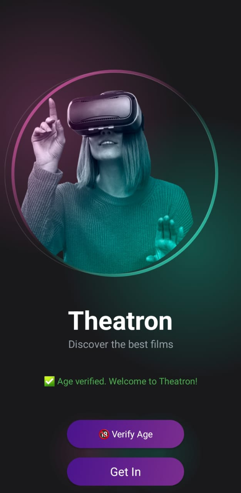
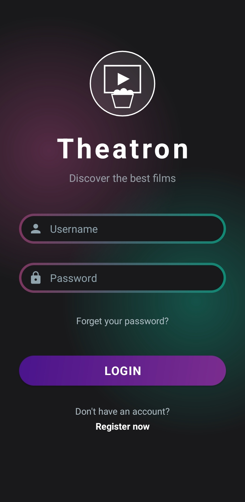
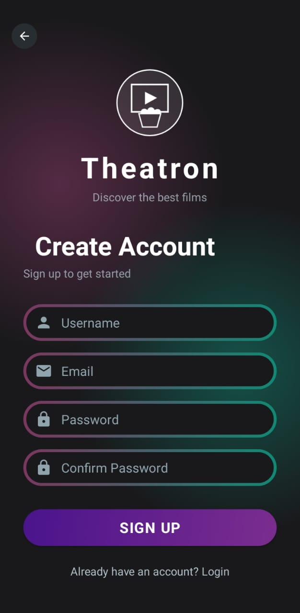

# 🎬 Theatron

## Description

Theatron is a modern and intelligent cinema mobile application designed to provide users with an interactive movie discovery experience.

The application allows users to:

* Explore popular and trending movies
* Watch official trailers
* Access movie descriptions and detailed information
* Discover actors and cast members
* Open movie streaming or watch links
* Browse a clean and modern cinematic interface

The main goal of Theatron is to combine entertainment, simplicity, and modern technologies into a single mobile platform.

---

## Features

* 🎥 Movie Catalog
* 📺 Official Trailers
* ⭐ Movie Ratings
* 🧾 Detailed Descriptions
* 👨‍🎭 Actors & Cast Information
* 🔗 Watch Links
* 🔍 Smart Movie Browsing
* 📱 Modern Android UI

---

## Technologies Used

### Backend

* FastAPI
* PostgreSQL
* REST API Architecture

### Frontend

* Android Studio
* Java
* XML Layouts

---

## Architecture

The application follows a client-server architecture:

```text id="jlwm6w"
Android Application (Java/XML)
            │
            ▼
        FastAPI Backend
            │
            ▼
        PostgreSQL Database
```

---

## Project Structure

```text id="mujm6y"
Theatron/
│
├── backend/
│   ├── FastAPI
│   └── PostgreSQL
│
├── frontend/
│   ├── Java
│   └── XML Layouts
│
└── README.md
```

---

## Screenshots

### Home Screen


---

### Movie Details



---

### Trailer Section



---

### Actors & Cast



---

## Demo Video

🎥 Watch the application demo here:

➡️ [Open Demo Video](https://drive.google.com/file/d/1O84M1XoAT6WscQ3HPFQY_kekSAmfXSFN/view?usp=sharing)

---

## Objective

The objective of this project is to develop a modern cinema platform that combines:

* Mobile development
* Backend API development
* Database management
* UI/UX design
* Intelligent movie browsing experience

---

## Future Improvements

* AI Movie Recommendation System
* User Authentication
* Favorites & Watchlist
* Search & Filtering
* Dark Mode
* Real-Time Trending Movies
* Cloud Deployment

---

## Author

Developed by Salaheddine.
